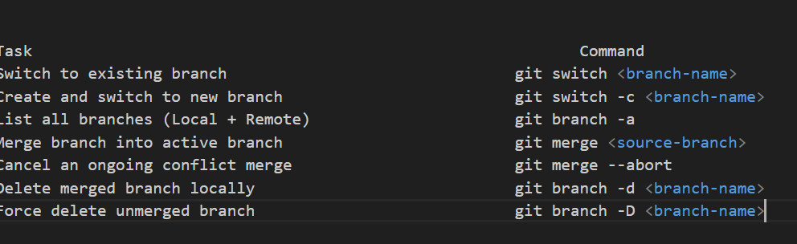

In this workflow, you keep main strictly for stable production-ready code and do all your daily work,testing and additions inside dev.

Step 1: Verify your starting state on main

Ensure you are starting on your main branch with a clean working directory:

git switch main
git status

Expected Output:

On branch main
Your branch is up to date with 'origin/main'.
nothing to commit, working tree clean

Step 2: Create and Switch to the dev branch: Create the dev branch off main and switch to it immediately:

git switch -c dev

What this does: Copies your entire current main state into a new branch named dev and places you on dev.

-c ---> This stands for create

Verify with git branch:

Expected Output:

* dev
  main

Step 3: Publish the dev Branch to GitHub
Now, establish upstream tracking for dev on your remote repository:

git push -u origin dev

Now if you go to github you will see two seperate branches has been created. If you switch branches from the portal you will see whatever existed in main previously has also been copied to dev. The question stands how?

When you run git switch -c dev while standing on main, Git creates dev as an exact carbon copy of main at that precise moment in time.Every single file, folder, commit history line, and code change that existed in main is immediately present in your new dev branch.

How it works behind the scenes?

How It Works Behind the Scenes
Think of a branch in Git not as a heavy folder full of copied files, but as a lightweight pointer (or label) pointing to a specific commit:

Commit 1 ──> Commit 2 ──> Commit 3
                            ▲
                       main │ dev  <-- Both point to the exact same history!
Before step 2, main points to Commit 3.

When you run git switch -c dev, Git creates a new label named dev and points it to Commit 3 as well.

Therefore, everything in main is inside dev.

Step 4: Make & Commit Changes on dev
Now that you are on dev, let's add new infrastructure code.

Open deploy.sh in VS Code.

Add a third line for Virtual Network creation:

echo "Deploying Azure Infrastructure..."
echo "Creating Resource Group: rg-production-eastus"
echo "Creating Virtual Network: vnet-production-eastus"
Save the file (Ctrl + S).

Stage and commit the change on dev:

git add deploy.sh
git commit -m "feat: Add virtual network creation script"
Push the updated dev branch to GitHub:

git push

Step 5: Merge dev into main (Production Release)
Now that your script changes on dev are complete and tested, it's time to promote them into production (main).

1. Switch back to main:
git switch main
(If you inspect deploy.sh in VS Code right now, notice the 3rd line disappears! That's because main doesn't have the new code yet).

2. Merge dev into main:
git merge dev
Expected Output:
Updating a1b2c3d..e4f5g6h
Fast-forward
 deploy.sh | 1 +
 1 file changed, 1 insertion(+)
(Look at deploy.sh in VS Code now—the 3rd line is back! main now has all the updates from dev).

3. Push the updated main to GitHub:
git push
Step 6: Verify Branch Synchronization
Run git log on both branches or inspect status to ensure main and dev are at the exact same commit:

git status
Expected Output:
On branch main
Your branch is up to date with 'origin/main'.
nothing to commit, working tree clean

When you run git merge dev while standing on main, you do not need to run git add or git commit manually for a very specific reason: git merge creates the commit for you automatically!

Here is exactly why that happens and how Git processes the merge behind the scenes:

Why git add and git commit Weren't Needed
The changes were ALREADY committed on dev:

Before switching to main, you already ran git add and git commit on the dev branch.

That code was already saved into Git's object database as a completed snapshot.

git merge performs a Fast-Forward or Merge Commit:

When you run git merge dev, Git looks at the commits sitting on dev and applies them directly to main.

Because there were no conflicting edits on main, Git performs a Fast-Forward merge. It simply moves the main pointer forward to match dev and automatically registers the commit.

The Only Exception: Merge Conflicts
The only time you will need to run git add and git commit after a merge is when there is a merge conflict (e.g., both main and dev edited the exact same line in different ways).

In that scenario:

git merge dev pauses and asks you to resolve the conflict in VS Code.

You manually fix the code.

You run git add <file> to mark the conflict as resolved.

You run git commit to finalize the merge.

Since your merge was clean, Git handled staging and committing automatically!

Now that dev and main are merged locally, the final step for this workflow is pushing main up to GitHub (git push). Reply "done" once you've pushed, and we will move to handling Merge Conflicts!

Day 4, Part 2: Understanding and Resolving Merge Conflicts
A merge conflict happens when Git cannot automatically merge two branches because the exact same line in the exact same file was modified differently on both branches.

Git stops the merge, flags the file, and asks you (the human engineer) to decide which code stays and which code goes.

Hands-on Scenario: Simulating a Merge Conflict
We are going to intentionally create a conflict between main and dev on line 3 of deploy.sh.

Step 1: Make a change on main (Production Edit)
Make sure you are on main:

git switch main
Open deploy.sh in VS Code.

Edit the 3rd line to read:

echo "Deploying Azure Infrastructure..."
echo "Creating Resource Group: rg-production-eastus"
echo "Creating Virtual Network: vnet-MAIN-PROD-eastus"
Save, stage, commit, and push on main:

git add deploy.sh
git commit -m "fix: Update VNet name on main for production"
git push
Step 2: Make a DIFFERENT change on dev (Dev Edit)
Switch to dev:

git switch dev
Open deploy.sh in VS Code.

Edit the 3rd line to read something different:

echo "Deploying Azure Infrastructure..."
echo "Creating Resource Group: rg-production-eastus"
echo "Creating Virtual Network: vnet-DEV-TESTING-eastus"
Save, stage, commit, and push on dev:

git add deploy.sh
git commit -m "feat: Update VNet name on dev for testing"
git push
At this point, main and dev have diverged! Both branches modified line 3 in different ways.

Step 3: Trigger the Merge Conflict
Now, switch back to main and try to merge dev into main:

git switch main
git merge dev
The Output You Will See:

Auto-merging deploy.sh
CONFLICT (content): Merge conflict in deploy.sh
Automatic merge failed; fix conflicts and then commit the result.

Step 4: Resolving the Conflict in VS Code
Look at deploy.sh in VS Code. VS Code highlights the conflicting section in color with conflict markers:

<<<<<<< HEAD (Current Change)
echo "Creating Virtual Network: vnet-MAIN-PROD-eastus"
=======
echo "Creating Virtual Network: vnet-DEV-TESTING-eastus"
>>>>>>> dev (Incoming Change)
<<<<<<< HEAD (Current Change): Code currently on main.

=======: The divider line.

>>>>>>> dev (Incoming Change): Code coming from dev.

Above the lines, VS Code provides interactive action buttons:

Accept Current Change (Keeps main line)

Accept Incoming Change (Keeps dev line)

Accept Both Changes (Keeps both lines)

Compare Changes

Click Accept Incoming Change (or manually delete the Git markers <<<<<<<, =======, >>>>>>> and leave the exact line you want).

Step 5: Finalizing the Merge
Once you resolved the file:

Check status:

git status
(You will see both modified: deploy.sh under Unmerged paths).

Stage the resolved file to mark the conflict as fixed:

git add deploy.sh
Commit the merge resolution:

git commit -m "fix: Resolve merge conflict for VNet naming between main and dev"
Push the final merge commit to GitHub:

git push

Aborting a Merge Conflict (Emergency Exit Command)
If you ever trigger a merge conflict and feel lost, you can cancel the merge completely and return your branch to how it was before running git merge:

git merge --abort

Task                                                           Command
Switch to existing branch                               git switch <branch-name>
Create and switch to new branch                         git switch -c <branch-name>
List all branches (Local + Remote)                      git branch -a
Merge branch into active branch                         git merge <source-branch>
Cancel an ongoing conflict merge                        git merge --abort
Delete merged branch locally                            git branch -d <branch-name>
Force delete unmerged branch                            git branch -D <branch-name>

